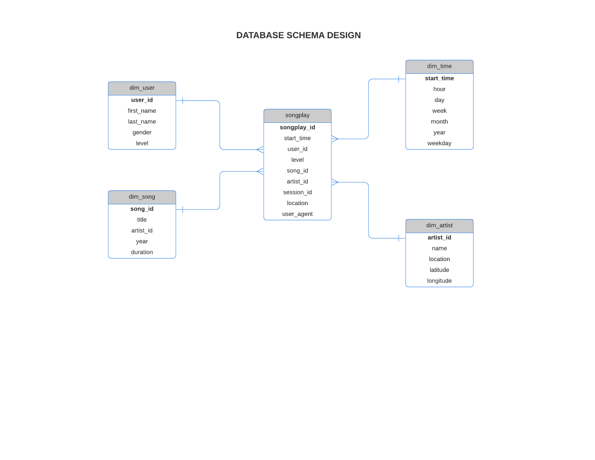
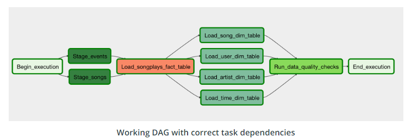

# Data Pipelines using Airflow

As part of Udacity Data Engineering Nanodegree a music streaming company, Sparkify, has decided that it is time to introduce more automation and monitoring to their data warehouse ETL pipelines and come to the conclusion that the best tool to achieve this is Apache Airflow.

## Overview

The project involves creating high grade data pipelines that are dynamic and built from reusable tasks, can be monitored, and allow easy backfills. They have also noted that the data quality plays a big part when analyses are executed on top the data warehouse and want to run tests against their datasets after the ETL steps have been executed to catch any discrepancies in the datasets.

The source data resides in S3 and needs to be processed in Sparkify's data warehouse in Amazon Redshift. The source datasets consist of JSON logs that tell about user activity in the application and JSON metadata about the songs the users listen to.

### Technologies Used:

* Python 3
* AWS S3 for storing data
* AWS Redshift Cluster
* Airflow

## Datasets

***

The dataset consists of 2 datasets residing in S3 bucket in the following directory

    Song data: s3://udacity-dend/song_data
    Log data: s3://udacity-dend/log_data

### Song Dataset
The first dataset is a subset of real data from the Million Song Dataset. Each file is in JSON format and contains metadata about a song and the artist of that song. The files are partitioned by the first three letters of each song's track ID. 

### Log Dataset
The second dataset consists of log files in JSON format generated by this event simulator based on the songs in the dataset above. These simulate app activity logs from an imaginary music streaming app based on configuration settings. 

# Process:

***

## Part I Data Modeling using Apache Cassandra
Using the song and log datasets, a star schema is implemented optimized for queries on song play analysis. This includes the following tables.

### Staging Tables

	* staging_events: event data telling what users have done (columns: event_id, artist, auth, firstName, gender, itemInSession, lastName, length, level, location,method, page, registration, sessionId, song, status, ts, userAgent, userId)
	* staging_songs: song data about songs and artists (columns: num_songs, artist_id, artist_latitude, artist_longitude, artist_location, artist_name, song_id, title, duration, year)

### Fact Table
**songplays** - records in log data associated with song plays i.e. records with page NextSong
songplay_id, start_time, user_id, level, song_id, artist_id, session_id, location, user_agent

### Dimension Tables
**users** - users in the app
user_id, first_name, last_name, gender, level

**songs** - songs in music database
song_id, title, artist_id, year, duration

**artists** - artists in music database
artist_id, name, location, latitude, longitude

**time** - timestamps of records in songplays broken down into specific units
start_time, hour, day, week, month, year, weekday

## Part II. Creation of Redshift Cluster and IAM Role in AWS 
    
The file aws.ipynb consists of the method to create an IAM Role to provide access to the S3 bucket as well as creating a custom
Amazon Redshift cluster.

	* In this example a Redshift dc2.large cluster with 4 nodes has been created, with a cost of USD 0.25/h (on-demand option) per cluster
	* In this example we will use IAM role authorization mechanism, the only policy attached to this IAM will be am AmazonS3ReadOnlyAccess

Update the AWS Key and Secret in the dwh.cfg file before running

At the end of the file the endpoint and the arn of the cluster will be printed out as 
   1. DWH_ENDPOINT
   1. DWH_ROLE_ARN

## Part III ETL Pipeline using Airflow

The project template package contains three major components for the project:

* The dag file(udac_example_dag)has all the imports and task templates in place and connects the Airflow
* The operators folder with operator templates and defines the structure for all the operator
* A helper class for the SQL transformations to load tables on redshift

*** DAG Layout ***

## Requirements
* Install Python3
* Install Docker
* Install Docker Compose
* AWS account and Redshift cluster

## How to Run:

	1. Update the dwh.cfg file with AWS Key and Secret for the User details
	1. Run the aws.ipynb file to create a Redshift cluster and IAM Role
	1. Add redshift database and IAM role info to dwh.cfg file
	1. Run the docker-compose up which contains the docker configurations to run the Airflow instance
	1. Start the Airflow instance using /opt/airflow/start.sh
	1. Update/Create the Connection strings 'redshift' and 'aws_credentials' in the connections in Airflow
	1. Run the DAGs by turning ON the DAG
	1. Run Analytical queries on your Redshift database
	1. Dlete the Redshift cluster and IAM Role using the aws.ipynb file

## Credits

This project was completed as part of Udacity Data Engineering Nanodegree

